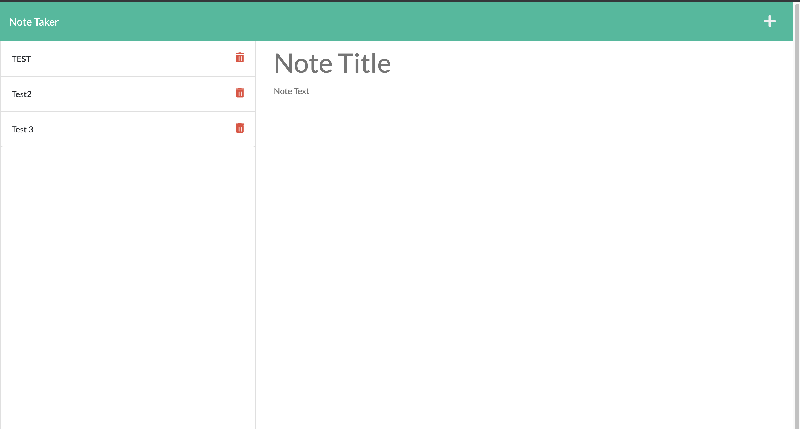

## Note-TakerER

### Description

This application is a note taker that is running with a server at heroku,
 you can write your note and save it in database and read it after if you want.

 > This application has CRUD operations but Update:
 - GET
 - POST
 - Delete

### Techologies

- HTML
- CSS
- JAVASCRIPT
- NODE JS

### Links

- [Heroku Link](https://ernotetaker.herokuapp.com/)
- [GitHub Repo ](https://github.com/raphson1/note-takerER)

### Licence

> This application has no Licence.

### Contibutors:

- Eric Ruboneka: 
  - [GitHub](https://github.com/raphson1)
  - Email: Raphsoneric@gmail.com

### Image

